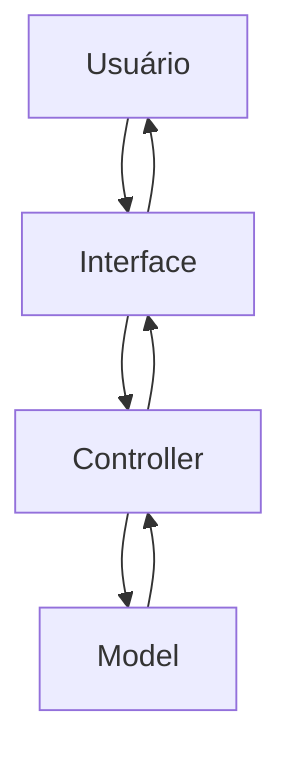
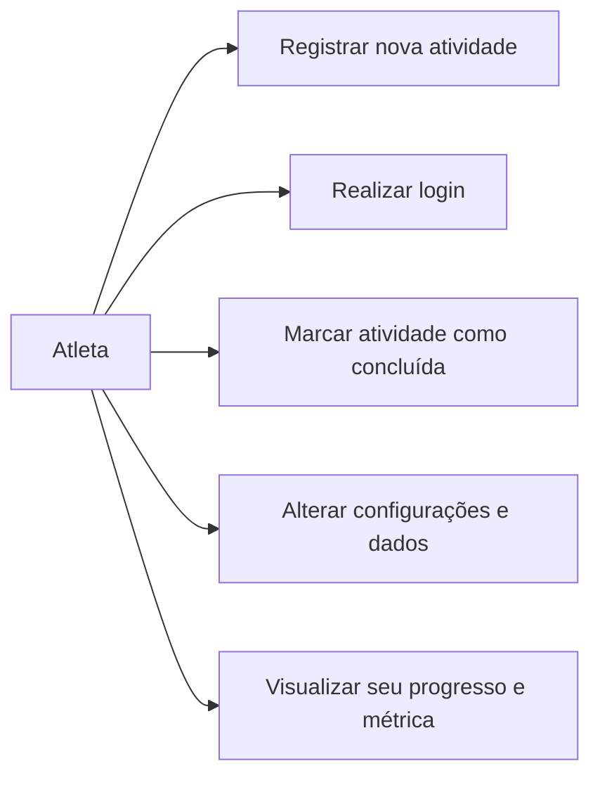

# Documentação de Especificações de Requistos de Software (SRS)

## FitLife - Monitor de Saúde e Atividades Físicas

**Padrão Internacional:** ISO/IEC/IEEE 29148:2018
**Versão:** 1.0.0
**Data:** 2026-04-30
**Autor:** Thayssa Maneo

---

## 1. Introdução

### 1.1 Propósito

Este Documento descreve os requisitos do sistema **FitLife Monitor**, com o objetivo de:

* definir funcionalidade;
* padrionizar entendimentos entre os stakeholders;
* servir como base para desenvolvimento e teste;

---

### 1.2 Escopo

O Sistema permitirá:

* Registro de atividades;
* Acompanhamento da evolução e de metas;
* Registro de metas;
* Visualização de um painel com métricas de sáude;

O Sistema será uma aplicação Mobile Android utilizando:

* Flutter
* Dart
* Arquitetura MVC
* Estrutura POO

Objetivos:

Desenvolver uma aplicação Mobile que permita a monitoração das atividades físicas de maneira clara e objetiva permitindo aos usuários o acompanhamento de suas rotinas de exercícios e hábitos saudáveis.

---

### 1.3 Definições e Acrônimos

Tabela de Termos e Definições

| Termos | Definições |
| - | - |
| Atividades | Exercício a ser realizado pelo usuário |
| Evolução | Registro de como foi o progresso do usuário desde o início |
| Métricas de sáude | Informações relaconadas a saúde do usuário |
| Metas | Objetivos a serem alcançados |

Lista de Acrônimos

* **FLM:** FitLife - Monitor de Saúde e Atividades Físicas;
* **RF:** Requisitos Funcionais;
* **RNF:** Requisitos Não Funcionais;
* **UC:**  Casos de Uso;
* **CA:** Critérios de Aceitação;

### 1.4 Visão Geral do Documento

Este Documento está Organizado em:

* Introdução e Visão Geral;
* descrição do sistema;
* requistos detalhados;
* modelos UML;
* regras de negócio;

---

## 2. Descrição Geral do Sistema

### 2.1 Perspectiva do Sistema

O Sistema é mobile, operando em dispositivos móveis.

---

### 2.2 Funções do Sistema

O Sistema deve:

* Registrar atividades;
* Simular login;
* Atualizar o estado de uma atividade;
* Atualizar dados;
* Alterar configurações;
* Validar operações;
* Exibir dados;
* Navegar entre diferentes telas;
  
---

### 2.3 Classes de Usuários

| Usuários | Descrição |
| - | - |
| Atleta | Registrar atividades, realizar login, alterar configurações, visualizar informações, mmarcar uma atividade como concluída |

---

### 2.4 Ambiente Operacional

* Android

---

### 2.5 Restrições

* não utiliza Banco de Dados;
* dados armazenado na memória;
* sem autenticação;

---

### 2.6 Suposições

* Usuário possui conhecimento de Informática;
* Volume de dados é pequeno;

---

## 3. Requisitos do Sistema

### 3.1 Requisitos funcionais

#### RF-01: Registro de Atividades

**Descrição:** Permitir registrar uma atividade.
- Prioridade: Alta
- Versão: 1.0
- Data: 2026-04-30
- Rastreabilidade: Necessidade do Stakeholder 01

**Critérios de aceitação**\
[] Entrada de dados: Nome, Categoria, Preço, Quantidade\
[] Validação dos campos\
[] Verificação de duplicidade\
[] Saída: Notificação para o usuário, atividade adicionada a lista

#### RF-02: Atualizar o Estado de uma Atividade

**Descrição:** Permitir marcar a atividade como concluída.
- Prioridade: Alta
- Versão: 1.0
- Data: 2026-04-30
- Rastreabilidade: Necessidade do Stakeholder 02

**Critérios de aceitação**\
[] Verificar se item já está concluído\
[] Adicionar a atividade a lista de concluídas\
[] Remover a atividade da lista de pendentes\
[] Saída: Notificação para o usuário

#### RF-03: Simular login

**Descrição:** Simular o login do usuário.
- Prioridade: Média
- Versão: 1.0
- Data: 2026-04-30
- Rastreabilidade: Necessidade do Stakeholder 03

**Critérios de aceitação**\
[] Entrada de dados: nome, email e senha\
[] Saída: Notificação para o usuário

#### RF-04: Atualizar Dados

**Descrição:** Permitir que usuário atualize seus dados (nome, meta).
- Prioridade: Alta
- Versão: 1.0
- Data: 2026-04-30
- Rastreabilidade: Necessidade do Stakeholder 04

**Critérios de aceitação**\
[] Entrada de dados: nome, meta\
[] Validação de campos\
[] Atualização das informações\
[] Saída: Notificação para o usuário

#### RF-04: Alterar configurações

**Descrição:** Permitir que o usuário altere configurações do aplicativo (tema, resetar progresso, configurar notificações).
- Prioridade: Média
- Versão: 1.0
- Data: 2026-04-30
- Rastreabilidade: Necessidade do Stakeholder 05

**Critérios de aceitação**\
[] Aplicativo atualiza tema, notificações\
[] Saída: Notificação para o usuário

#### RF-06: Exibir Dados

**Descrição:** Exibir as listas de atividades concluídas, pendentes, métricas de saúde.
- Prioridade: Alta
- Versão: 1.0
- Data: 2026-04-30
- Rastreabilidade: Necessidade do Stakeholder 06

**Critérios de aceitação**\
[] Listagem de informações\
[] Saída: Dashboard exibindo as informações, duas listas com as atividades

---

### 3.2 Requisitos Não Funcionais

#### RNF-001: Usabilidade
**Descrição:** Interface Simples e Intuitiva.

#### RNF-002: Desempenho
**Descrição:** Respostas Rápidas e Inferiores a 1 Segundo.

#### RNF-003: Arquitetura de Software MVC
**Descrição:** Estrutura da Arquitetura de Códigos em Padrão MVC (Model, View, Controller).

#### RNF-004: Utilização do Provider
**Descrição:** Utilização da dependência provider para manipulação dos dados inseridos.

#### RNF-005: Confiabilidade
**Descrição:** Validação de Entrada de Dados Obrigatória.

---

## Regras do Negócio

Tabela de Regras
|Regras de Negócio|Descrição|
|-|-|
| RN-01 | Quantidade de atividades não pode ser negativa |
| RN-02 | Não pode existir duas atividades iguais |
| RN-03 | Atualizações de métricas automáticas |
| RN-04 | Progresso não pode ser negativo |

Pode Existir Restrições para o Negócio (legais, locais, etc...).

## 5. Modelos do Sistema

### 5.1 Diagrama de Casos de Uso

Diagrama de casos de uso: O que o sistema deve fazer do ponto de vista do usuário.

---

## 5. Análise de Risco

| Risco | Impacto | Mitigação |
| - | - | - |
| Perda de Dados | Alto | Usar armazenamento local |
| Entrada de Dados | Médio | Validar as Entradas de Dados |

---
## 6. Controle de Versões

### 6.1 Histórico de Alterações

| Versão | Data | Autor | Modificação |
|-|-|-|-|
| 1.0.0 | 2026-04-30 | Thayssa Maneo | Versão Inicial |

### 6.2 Aprovações

| Papel | Nome | Data | Assinatura |
|-|-|-|-|
| StakeHolder | --- | 2026-04-30 | [] |